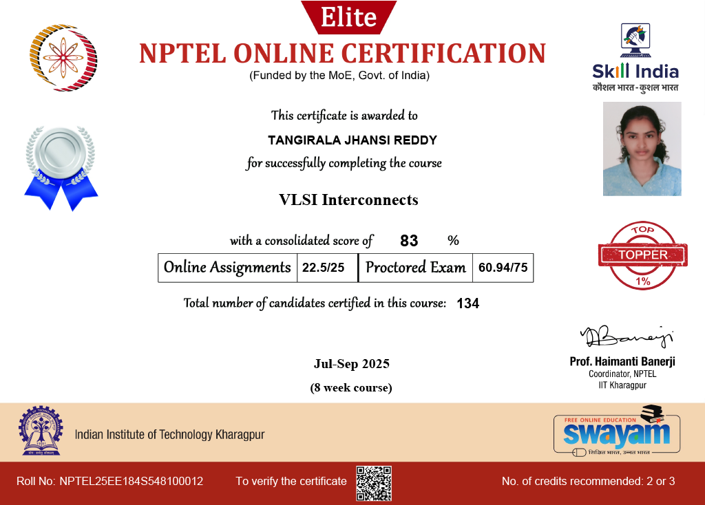
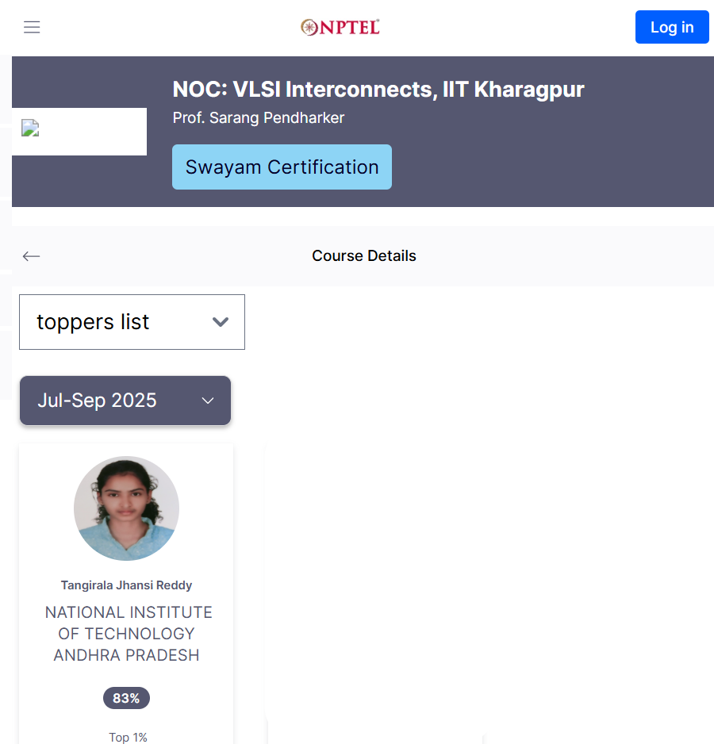

#NPTEL

##Course: VLSI Interconnects
###Professor: Sarang Pendharker

!!! note "Course Details"
    Interconnects are the wired connections between various devices and components in an integrated circuit. As the clock frequency and operating frequency of the electronic devices is increasing, going up to several GHz, the effects of these wired connection cannot be ignored anymore. In fact, the interconnect effects which include delays, timing jitters and cross-talk are expected to become bottleneck in further increase in the speed of electronic circuits. In this course we will investigate origin of several interconnect effects and explore techniques for electromagnetic and circuit modeling of these interconnect effects. The course is of importance for anyone interested in the high frequency circuit design and signal integrity issues in electronics and telecommunication industries.

#Certificate

??? info "To verify the details"
    Visit [NPTEL course website](https://nptel.ac.in/courses/108105187) then navigate to toppers list of Jul-Sep 2025.

    

