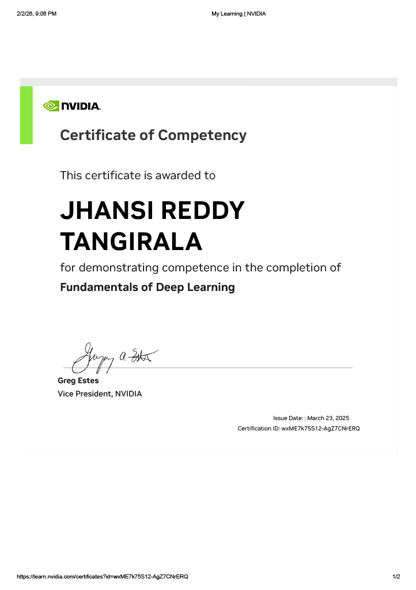

#NVIDIA

!!! note "About the workshop"
    Deep learning is a powerful AI approach that uses multi-layered artificial neural networks to deliver state-of-the-art accuracy in tasks such as object detection, speech recognition, and language translation. Using deep learning, computers can learn and recognize patterns from data that are considered too complex or subtle for expert-written software

###Topics Covered
- PyTorch
- Convolutional Neural Networks (CNNS)
- Data Augmentation
- Transfer Learning
- Natural Language Processing

##Certificate

