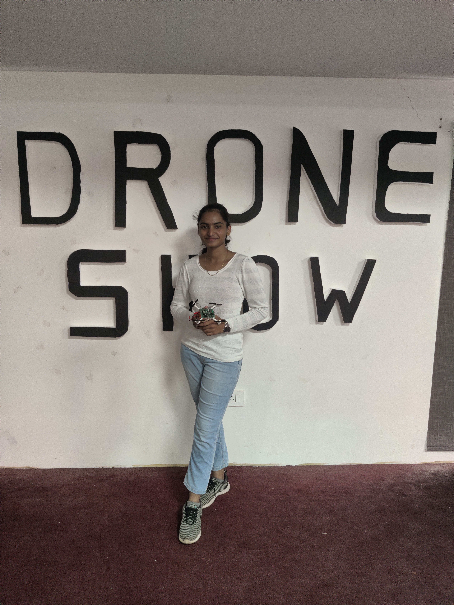
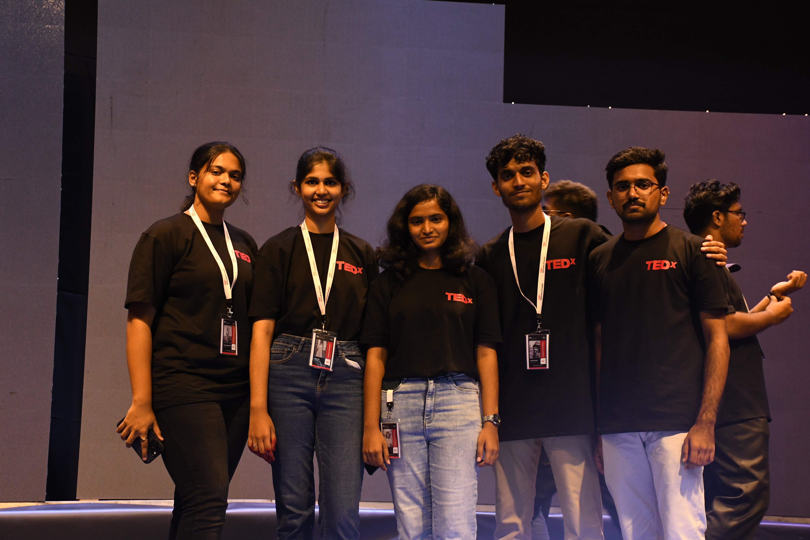
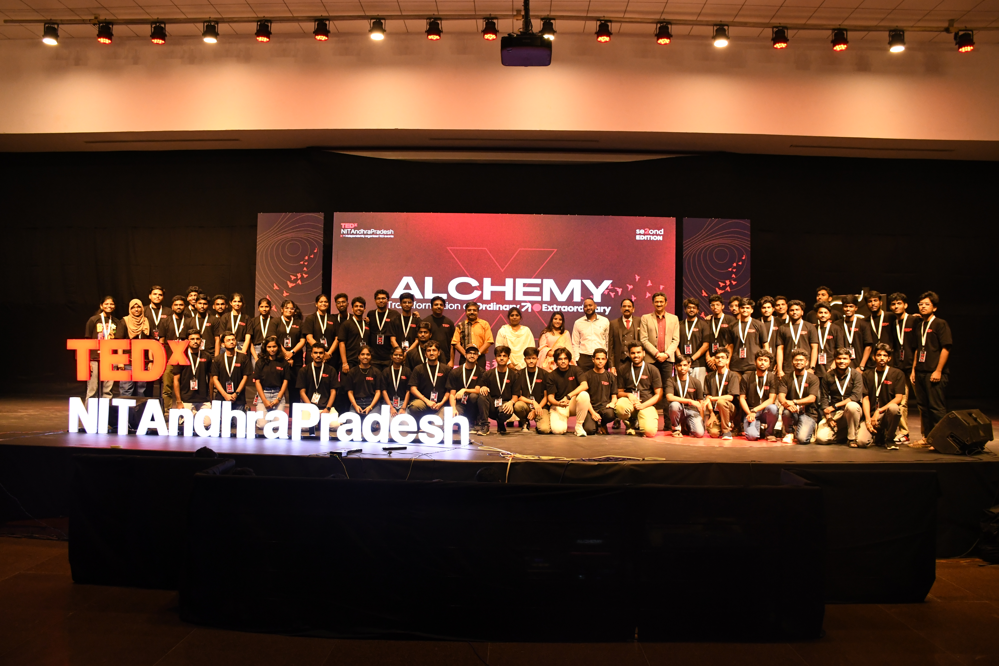

# Volunteer Experience
---
## AI & Robotics Club
### Executive member

During my time in the AI and Robotics club, I helped organize technical workshops and coordinated various club activities. The club environment greatly accelerated my learning and changed my perspective on innovation, and the friendships I formed there are invaluable to me.

As a team member, I participated in developing a palm-sized mini drone using the Raspberry Pi Pico as the primary controller. We implemented custom firmware in the Arduino IDE with PID control to achieve stable flight and enabled Wi-Fi-based control via a UDP joystick mobile application for low-latency operation.

Duration: Oct 2023 – Apr 2025

{width="400", align="left"}

{align="right"}

---

## TEDx NIT Andhra Pradesh
### Curator

TEDx NIT Andhra Pradesh event is a memorable experience for me. It gave me the chance to interact with inspiring and talented individuals, including one of my favourite educators, Mahesh Shenoy. 
Additionally, I learnt how a good leader influences their team and how they tackle difficult challenges. During the event, I assisted with the theme and managed speaker selection.

Duration: Jun 2024 – Oct 2024

TEDx curation team members

TEDx NITAndhraPradesh Team
