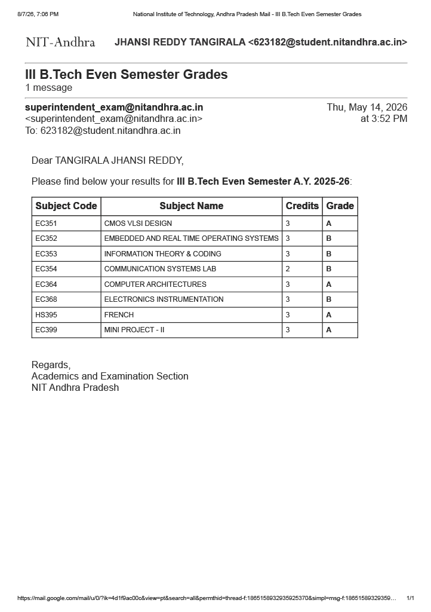
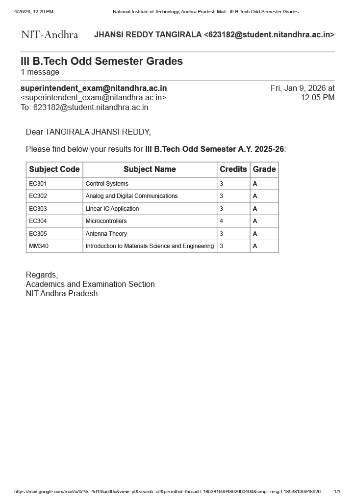
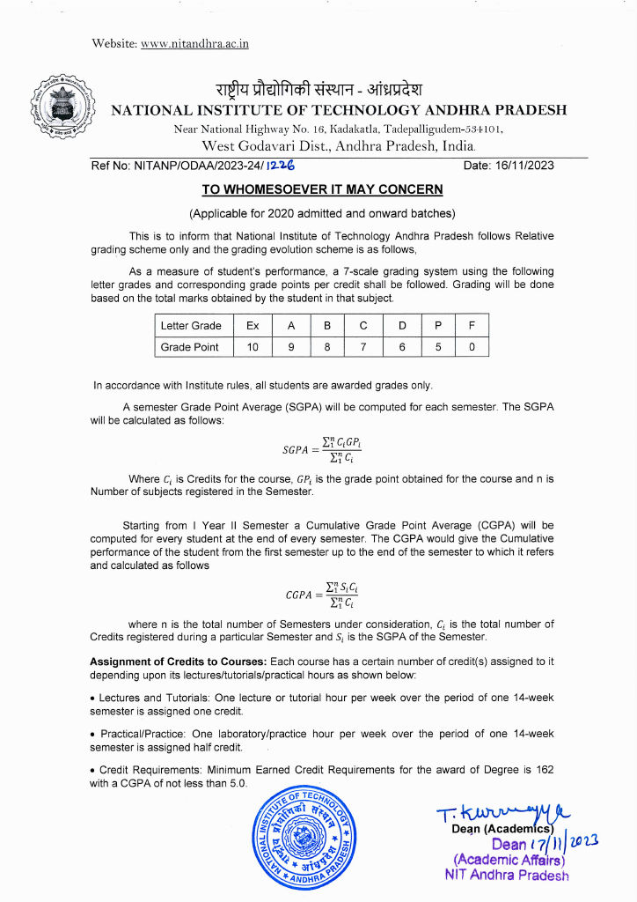
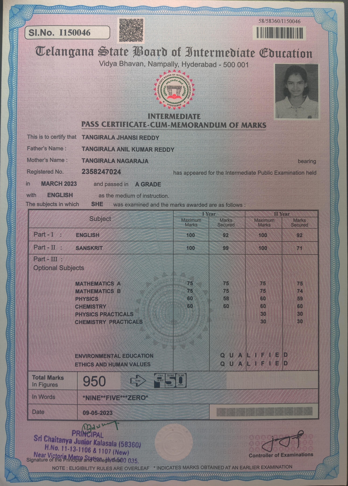
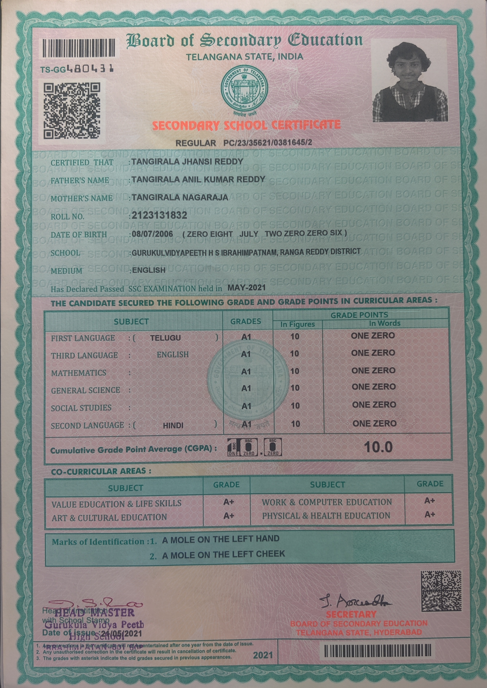

# GPA

## University
National Institute of Technology Andhra Pradesh
### Current CGPA 
8.29/10 till 6th semester

### 6th semester grade sheet

### 5th semester grade sheet

### Grading Scheme at NIT Andhra pradesh

## 12th Grade
Sri Chaitanya Junior Kalasala  
Score - 950/1000  
year - 2023  

## 10th Grade
Gurukula Vidyapeeth High School 
Grade - 10/10 
year - 2021 

