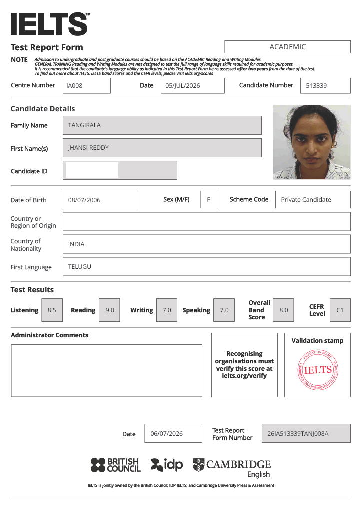
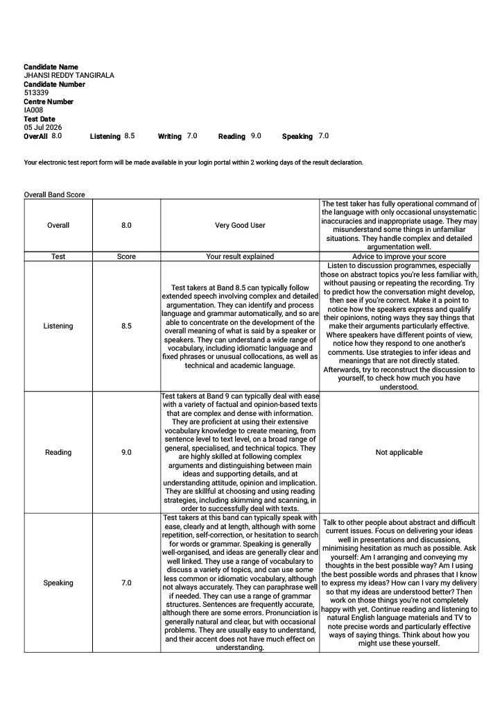
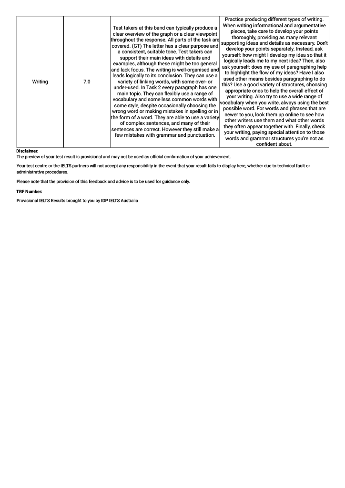

#IELTS

!!! info "About IELTS"
    IELTS stands for the International English Language Testing System – an English Language proficiency test. Globally, there are more than 4 million test takers a year, making IELTS the world’s most popular English language proficiency test for higher education and global migration. IELTS is developed and run by the British Council in partnership with IDP Education and Cambridge Assessment English.

## My IELTS score
test day: 05 July 2026

!!! note ""
    Overall Band Score - 8.0/9.0  
    Reading - 9.0/9.0  
    Listening - 8.5/9.0  
    Writing - 7.0/9.0  
    Speaking - 7.0/9.0

## Interpretation of the score

