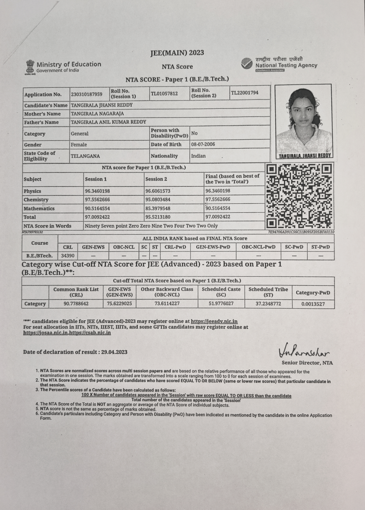

#JEE MAINS

!!! note "JEE MAINS entrence exam"
    The Joint Entrance Examination – Main (JEE–Main), is an Indian standardized computer-based test for admission to various technical undergraduate programs in engineering, architecture, and planning across colleges in India. The exam is conducted by the National Testing Agency for admission to B.Tech, B.Arch, B.Planning etc. programs in premier technical institutes such as the National Institutes of Technology (NITs), Indian Institutes of Information Technology (IIITs) and Government Funded Technical Institutes (GFTIs) which are based on the rank secured in the JEE–Main.

##Score card
