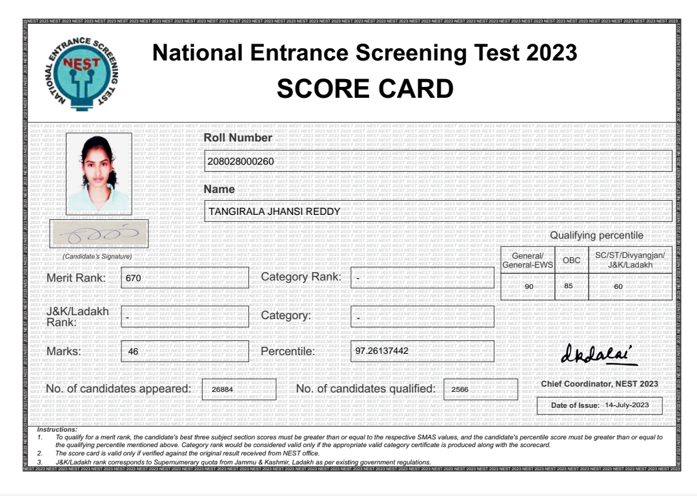

#NEST

!!! info "About NEST"
    The National Entrance Screening Test (NEST) is a compulsory online computer-based test for admission to the five-year Integrated MSc programme offered by the National Institute of Science Education and Research (NISER) and the University of Mumbai - Department of Atomic Energy Centre for Excellence in Basic Sciences (UM-DAE CEBS). NISER and UM-DAE CEBS are autonomous institutions established by the Department of Atomic Energy (DAE), Government of India, in 2007. These institutes were started with the mandate of providing research-oriented teaching in basic sciences by faculties of practising scientists aimed at creating a national pool of human resources to lead the nation to excellence in teaching and research in basic and applied sciences.

##Score card
