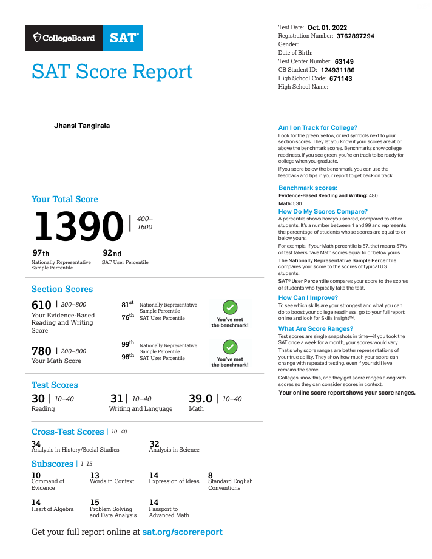

#SAT

!!! note "The SAT test"
    The SAT is a standardized test widely used for college admissions in the United States. Created and administered by the College Board, the exam assesses a student’s readiness for college by evaluating key skills in reading, writing, and mathematics 
    - Definition provided by MAGOOSH

##My Best SAT score

???+ question "What is a good SAT score?"
    According to Collegeboard, the average SAT score is around 1050, so if your score is higher than that, it’s above average. A score of 1350 or higher is in the top 10% of SAT test takers.

##My first SAT score

!!! note ""

    I am grateful to Buddy4Study for awarding me a scholarship to help cover a part of my first SAT fee.

