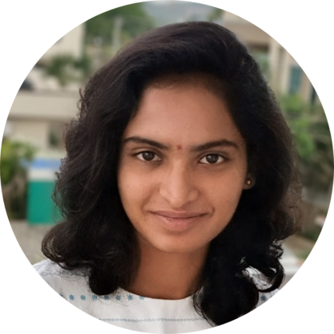

# Hi there! 

{width="150", align="left"}

**"LEARNING SHOULD BE FUN"** 
I am Jhansi, and I am glad you chanced upon my documentation site. Here you can explore my projects, research certificates, scores and my current work.  

<!-- more --> 

------------------------------
## Summary
I am a 4th year ECE student at NIT Andhra Pradesh with experience in FPGA design, computer architecture, radar and signal processing. Currently seeking opportunities to develop efficient and scalable hardware systems. Interested in contributing to multidisciplinary engineering solutions with a focus on
hardware–software co-design.

## Areas of Interest
- FPGA design and Computer Architecture
- hardware-software co-design
- Radar and signal processing
- VLSI Subsystems

## Currently exploring:
Photonic interconnects -- an emerging technology that caught my interest through my coursework in VLSI Interconnects. I am looking for opportunities to gain practical experience and explore the field further.

## My values
1. Honesty
2. Determination
3. fairness

## Extracurricular Activities
:woman_running: **Runner** 
Thanks to my dear friend Renuka and Coach Bennett (Nike Run Club), I got into running this year. It never interested me before, I thought it was just a warm up for sports. 

However, my perspective has completely changed now. I used to be exhausted by the time I completed 2 laps, but after just one week of running I was doing 7 laps non-stop and still feel great! Whenever I felt like giving up, I would ask myself this question: _Can I do 1 more lap?_ If yes, I would continue running, it often leads to more than 1 lap; If not, I would try again next time. 

This way I learnt to overcome the thoughts of giving up, and tried to push myself harder. Furthermore, I also learnt to understand my body, its limitations and strengths. Sometimes, running is entirely a mind game.

:woman_swimming: **Swimmer** 
Water has taught me humility and respect.  
Every year I await for summer to swim. What I enjoy the most is when you enter the pool, the cold water shocks you. After a few minutes your body adjusts to the water and slows down the heart and respiration rate. As this is happening, I feel relaxed and happy.

Learning to navigate the water was always fun and I learnt to swim pretty quickly. I can swim freestyle, backstroke and breaststroke at a relatively moderate  pace. One day I tried to swim at deep end while I was already exhausted. This is when I was trying overcome the fear of deep water and doen't how to tread water. Little did I know, this is one of the common reasons for drowning and I almost drowned that day. Luckily I was saved by a nearby swimmer and I am grateful to her. 

That day I learnt a lesson that I'd never forget -- Overconfidence, without assessing the situation leads to ruin. Not only that, I also taught myself a survival skill; That is to float on my back whenever I feel that I about to be exhausted, giving myself a chance to rest.

I am still learning to tread water. I don't know why it's taking me so long. Any suggestions? I'd really appreciate your help in this one.

:books: **literature** 
I have always been keen on reading novels and books; after all, they have shaped my imagination.

Here are few of my best reads: 

1. The Forest of Enchantments | Novel by Chitra Banerjee Divakaruni
2. Surely You're Joking, Mr. Feynman! | Book by Ralph Leighton and Richard Feynman
3. The Murder of Roger Ackroyd | Novel by Agatha Christie
4. Janapaduni Jabulu | by Boyi Bhimanna