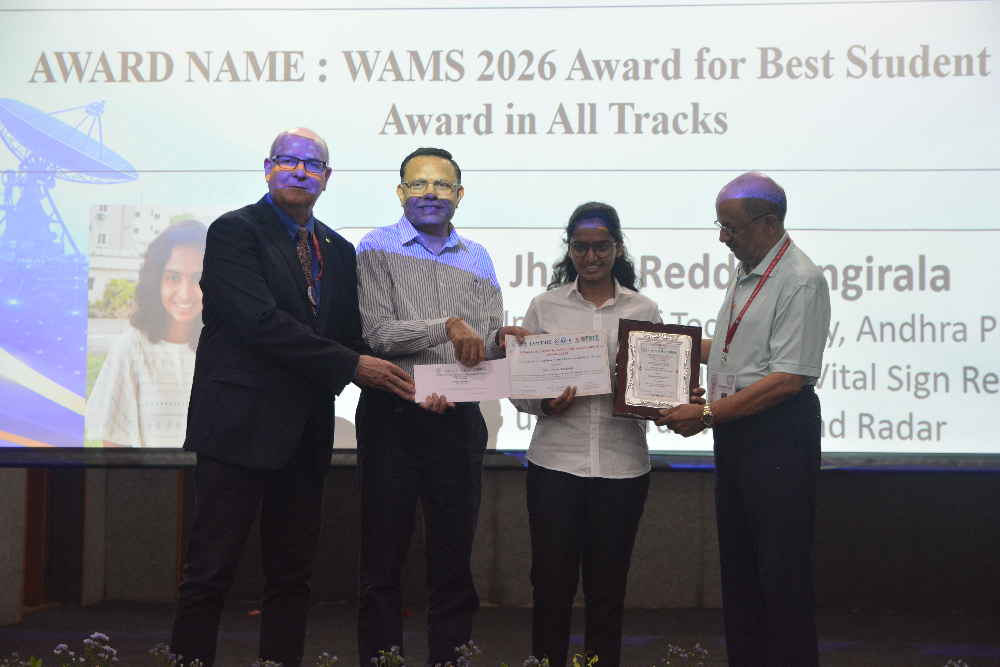
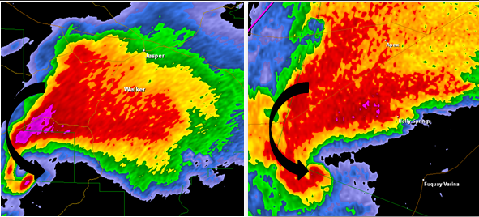

# Human Activity and Vital Sign Recognition using Ultra Wide Band Radar
UWB Radar, a solution to both contact-free respiration monitoring and non-invasive human motion detection.

<!-- more --> 

Respiratory rate is an essential clinical parameter, often assessed using ECG-based systems; however, prolonged electrode-based monitoring may cause discomfort or be unsuitable for patients with skin complications. UWB radar provides a contact-free alternative that can overcome such limitations. 

Additionally, UWB radar plays a crucial role in human activity detection due to its high-resolution ranging and ability to penetrate walls, while preserving privacy compared to cameras or wearables. It excels in low-visibility environments, ensuring reliable activity monitoring even in darkness.
 

??? tip ":trophy: WAMS 2026 Award for Best Student Paper Award in All Tracks"
     To verify go to [WAMS 2026 student awards](https://wams2026.com/student-awards/) and scroll down to S3.
    

    **What does this award mean to me?**

    This is our first research paper, so we did not expect much. All our focus was on delivering our best - whether it is organisation, replicability or transparency. Later I realized that with persistence and collaboration we can achieve great things in life.

    Additionally, we are grateful to our mentor [Dr. Puli Kishore Kumar](https://nitandhra.ac.in/dept/ece/20015) for guiding us and has provided the opprtunity to work with state of the art radar sensor. Finally I would like to acknowledge [Anish](https://github.com/anish609609) for his unwavering support and hardwork. His dedication to this work is monumental. 

???+ abstract
    This work presents a lightweight framework for UWB-based human activity classification and respiration rate estimation utilizing TDSR P452 ultra-wideband (UWB) radar sensor. The proposed approach classifies four distinct activities: sitting, standing, falling, and walking. Human activity signatures are extracted from the received radar signals using motion filtering and background subtraction to facilitate activity classification. Four filtering techniques—namely FIR2, FIR4, IIR2, and a second-order difference filter—undergo evaluation for motion detection, with the second-order difference filter demonstrating the most effective performance. Radar-based vital sign monitoring offers a contact-free and non-invasive approach for medical and surveillance applications. Band-pass filtering and peak detection are employed to estimate the respiration rate of the subject from the received radar signals. Comparison with manual participant breathing counts validates the accuracy of the estimated respiration rates. 

## Tools
[TDSR P452 Radar](https://tdsr-uwb.com/radar-sensor/) 
[MRM GUI](https://tdsr-uwb.com/radar-software/) 
[Matlab R2025b](https://in.mathworks.com/products/new_products/release2025a-2025b.html) 

Let's start with the basics

## What is a Radar?

### Radar Signature
A radar signature consists of information about characteristic echo signals of a reflecting object (target). Like a fingerprint, it is a way to determine the type of target.

??? example "Example"
    **Weather Radar** 
    The WSR-88D(Weather Surveillance Radar, 1988 Doppler) operates by sending out directional pulses at several different elevation angles, which are microseconds long, and when the pulse intersects water droplets or other artifacts, a return signal is sent back to the radar. From this return signal, the diameter of the object, along with distance, and intensity can be calculated, along if the object is moving toward or away from the radar.

    Hook echo 

    

    The hook echo is the classic radar signature for tornadic supercells, appearing as a curved, hook-shaped appendage on reflectivity scans.

    Recognition of the hook echo has been around for decades; even before Doppler radar was invented and instituted in forecast offices, forecasters issued tornado warnings solely based on the visual appearance of a hook echo on radar.

