# Human Activity and Vital Sign Recognition using Ultra Wide Band Radar
{width="500"}

UWB Radar, a solution to both contact-free respiration monitoring and non-invasive human motion detection.

<!-- more --> 

Respiratory rate is an essential clinical parameter, often assessed using ECG-based systems; however, prolonged electrode-based monitoring may cause discomfort or be unsuitable for patients with skin complications. UWB radar provides a contact-free alternative that can overcome such limitations. 

Additionally, UWB radar plays a crucial role in human activity detection due to its high-resolution ranging and ability to penetrate walls, while preserving privacy compared to cameras or wearables. It excels in low-visibility environments, ensuring reliable activity monitoring even in darkness.
 

??? tip ":trophy: WAMS 2026 Award for Best Student Paper Award in All Tracks"
     To verify go to [WAMS 2026 student awards](https://wams2026.com/student-awards/) and scroll down to S3.
    

    **What does this award mean to me?**

    This is our first research paper, so we did not expect much. All our focus was on delivering our best - whether it is organisation, replicability or transparency. Later I realized that with persistence and collaboration we can achieve great things in life.

    Additionally, we are grateful to our mentor [Dr. Puli Kishore Kumar](https://nitandhra.ac.in/dept/ece/20015) for guiding us and has provided the opprtunity to work with state of the art radar sensor. Finally, I would like to acknowledge [Anish](https://github.com/anish609609) for his unwavering support and hardwork. His dedication to this work is monumental. 

???+ abstract
    This work presents a lightweight framework for UWB-based human activity classification and respiration rate estimation utilizing TDSR P452 ultra-wideband (UWB) radar sensor. The proposed approach classifies four distinct activities: sitting, standing, falling, and walking. Human activity signatures are extracted from the received radar signals using motion filtering and background subtraction to facilitate activity classification. Four filtering techniques—namely FIR2, FIR4, IIR2, and a second-order difference filter—undergo evaluation for motion detection, with the second-order difference filter demonstrating the most effective performance. Radar-based vital sign monitoring offers a contact-free and non-invasive approach for medical and surveillance applications. Band-pass filtering and peak detection are employed to estimate the respiration rate of the subject from the received radar signals. Comparison with manual participant breathing counts validates the accuracy of the estimated respiration rates. 

--------------------------------

## Tools
[TDSR P452 Radar](https://tdsr-uwb.com/radar-sensor/)<br>
[MRM GUI](https://tdsr-uwb.com/radar-software/)<br>
[Matlab R2025b](https://in.mathworks.com/products/new_products/release2025a-2025b.html) 

-----------------------------

## Radar basics

### What is a Radar?
The word radar comes from the acronym **RA**dio **D**etection **A**nd **R**anging. As the name implies, radars use radio waves to determine the distance and velocity of the targets they hit. A radar system usually consists of a transmitter to send out radio signals and a receiver to catch any reflected energy from targets.


### Early use of radars
Radars were first used to lift the fog of war. In 1940, Great Britain utilized a network of radar installations known as the **Chain Home system** to provide crucial early warning during the Battle of Britain. By detecting incoming German bombers from as far away as 160 miles, these systems allowed the British to strategically concentrate their Spitfire and Hurricane interceptors against attacking forces.

This timely intelligence helped the British achieve numerical parity and successfully deny Germany the air superiority required for a planned invasion. Consequently, the invasion of Great Britain was postponed indefinitely, securing a vital staging area for the Allies.

### Applications
+ Surveilance
+ Tracking
+ Fire control
+ Target ID/discrimination
+ Ground surveillance/reconnaissance
+ Ground mapping
+ Moving target detection
+ Air traffic control
+ Missile seekers

### Attributes
+ Long range
+ All weather
+ Day/night
+ 3-space target location
+ Reasonably robust against countermeasures

### TDSR P452 radar sensor  
{width="100", align="left"}

The P452 UWB Module is an Ultra Wideband radio transceiver designed for precise ranging, communication, and radar applications, featuring high accuracy and low power consumption. It operates using Two-Way Time-of-Flight technology, supports multiple communication protocols, and can function in various radar configurations.<br>

The radar sensor consists of two omnidirectional antennas. We operated the radar in monostatic mode, so one antenna is the transmitter and the other is the receiver. Additionally, it has 2 usb B ports (one for data and the other is for power.), 1 ethernet, and GPIO ports (for API control). 

### Technical Specifications


| Specification | Description                          |
| ----------- | ------------------------------------ |
| **Transmitted pulse**      |      Derivative of the Gaussian pulse, specifically a 500ps monocycle waveform as shown below. The waveform starts as a Gaussian pulse but is then filtered to meet the regulatory emissions mask.  |
| **Pulse duration**     |   1ns |
| **Pulse repetition frequency**   |     10MHz|
| **Pulse spectral density** |  -41 dBm/MHz (max) |
|**Antenna** | planar elliptical dipole Ultra-wideband (UWB) antenna |
| **Polarisation** |  linear polarisation |
| **centre frequency** | 4.3GHz |
| **Bandwidth** | 600MHz, functioning within a range of 4.0 to  4.6GHz |
| **operating modes** |monostatic (transmitter and receiver are co-located or same antenna), bistatic, or multistatic|
|Transmitted pulse | |
| Received pulse in frequency and time domain |  |


### Working principle


Pulse radar systems send out short bursts or pulses of high energy waves followed by long periods of silence, where the receiver is listening for the reflected signal.


1. So the transmitted waveform in pulse radar would look something like in fig 1. Initially, the transmitter is idle and then it transmits the signal for some period (known as pulse width) and then stops. (Note: the illustration assumes the carrier wave contains only 1 frequency component. For P452, the frequency spectrum is spread over from 4.0 to 4.6GHz)

2. Assume the transmitted pulse has frequency of 4.3GHz. Since the transmit frequency is so high, it can be represented as an outline of the amplitude of the signal, as shown in fig 2. This fixed frequency scheme is called a rectangular pulse.

3. In a pulsed radar system, the pulse has to radiate out, reflect off of an object and return to the radar before the next pulse is sent out. This is so that there is no ambiguity as to which pulse the echo belongs to. It's always the pulse that is just sent. But because of this if we want a radar that can operate over long distances, then we need to allow enough time between pulses to account for the speed of light travel to and from the object. In fig. 3 we are sending out a pulse every 0.1μs or with a pulse repetion frequency of 10MHz.

4. Within the maximum umambiguious range, each pulse will have an associated echo pulse. These signals are much weaker than the transmit pulse, as much of the power is lost to the environment, shown in fig. 4.

5. The received signal will look something like in fig.5, as electronics and environment introduce noise into the signal. The range to the object is calculated by determining the round trip distance that light would have travelled in Δt time.

-------------------------

## MRM RET GUI
The Monostatic Radar Module Reconfiguration and Evaluation Tool (MRM RET) is a Microsoft 
Windows-based Graphical User Interface (GUI) program that provides an easy and illustrative means 
for (a) manipulating the configuration parameters of either TDSR’s P400 series of UWB modules and 
(b) demonstrating their operation as Ultra Wideband (UWB) monostatic radar sensors. 

### Configuration Tab
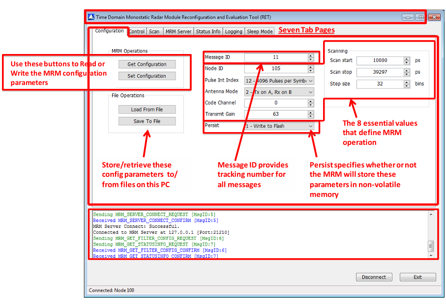

| Field       | Description  | Range| Example |
| ----------- | -------------|--------|--------|
| `PII`       | Pulse Integration Index: Since the MRM has been designed for coherent operation, it is possible to integrate multiple scans and thereby improve the received Signal-to-Noise Ratio (SNR). Each time the integration is doubled, the SNR of the received signal will improve by 3dB. |6 - 15 (2^6 - 2^15 pulses) |PII of 15 will integrate 32,768 (2^15) scans and thereby provide an SNR improvement of 45 dB. [Learn more](https://youtu.be/NtyU6aKZ-cY?si=b-tJSHsP1nvpw3Ne&t=527)| 
| `Transmit Gain`       |  When set to zero, the unit will transmit at the minimum  power supported by the MRM.   Setting to transmit gain to a value of 63 will set the unit to maximum transmit power. | 0 - 63 | Recommended - 63|
| `Start scan`    | While this field is entered in increments of picoseconds (ps), the MRM converts the input values into “bins,” where each bin is 1.907 ps | varies depending on swath| Because this conversion involves rounding, the value shown in Scan Start may not match the value originally entered by the user.  For example, setting a Scan Start value to 5000 will actually result in the Scan Start value being set to 4999. |
| `Scan stop` | While this field is entered in increments of ps, it is constrained in two ways. First, the MRM converts the input values from ps into “bins,” where each bin is 1.907ps. Second, the Scan Stop entry is further constrained by the Scan Start point and the MRM rake receiver architecture. The MRM produces a radar scan using several samplers acting in parallel as a rake  receiver. | varies depending on swath | Because of this architecture, the difference between Scan Start and Scan Stop must be in even multiples of 5859.36 ps.  This quantizes the radar scan data into blocks of 96 readings covering 5859.36 ps.|
| `Step size` |  This parameter controls the resolution with which the radar waveaform is captured. | recommended - 32 bins (equivalent to 1.907*32 ps) | In other words with a step size of 32, the received radar waveform will be measured every 61ps. |


???+ tip ":star: How to select scan start and stop values"
    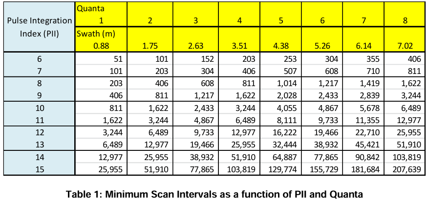
    Each scan requires a certain amount of time to complete.  This time is a function of the integration rate and the size of the scan window (difference between the Scan Start and Scan Stop times).  The time required is determined by the following equations. 

    **Scan time (µs) = (# of quanta in scan window) * (0.792 µs) * (2^(Pulse Integration Index))**

    Where a quanta (i.e., the rake sampler size) = 5859 ps 
     
    For example, selecting a Scan Start value of 10,000 ps and a Scan Stop value of 21,000 ps results in a requested swath size of 11,000 ps.  Dividing 11,000 by 5859 gives a value of 1.87 quanta.  The MRM will round this up to 2 quanta.  If the user requests a PII of 13, then the minimum scan time (or fastest update rate) will be 12,977 µs (77 Hz).  If the operator enters an Interval higher than this, then the radar will idle between scans. If the operator enters an Interval smaller than this, then the radar will operate as fast as possible.  

    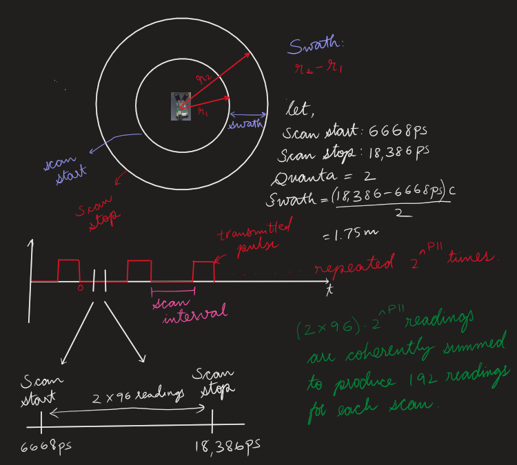


### Control Tab
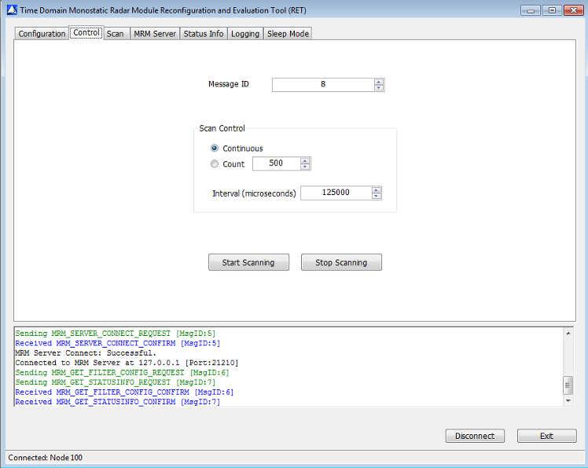

Radar scans can be started and stopped by clicking on either the Start Scanning or Stop Scanning buttons. 

| Field       | Description  |  
| ----------- | -------------|
| `Scan control`| By selecting the **Continuous** option, the user is requesting that scans be generated indefinitely at an interval defined by the contents of the “Interval (microseconds)” box.<br> By selecting the **Count** option, the user is requesting that MRM produce the number of scans indicated in the Count field at an interval defined by the contents of the “Interval (microseconds)” field. The maximum allowed interval is 2,000,000 microseconds.    
| `Start scanning`|  When Start Scanning is selected, the Scan Message ID number will be set equal to the present Message ID number and scanning will begin. Scanning will be executed based on the contents of the Scan Control box. 
| `Stop scanning`| Clicking on Stop Scanning will stop the scans and will reset the Scan Message ID number to the current value of the Message ID number. 

### Scan Tab
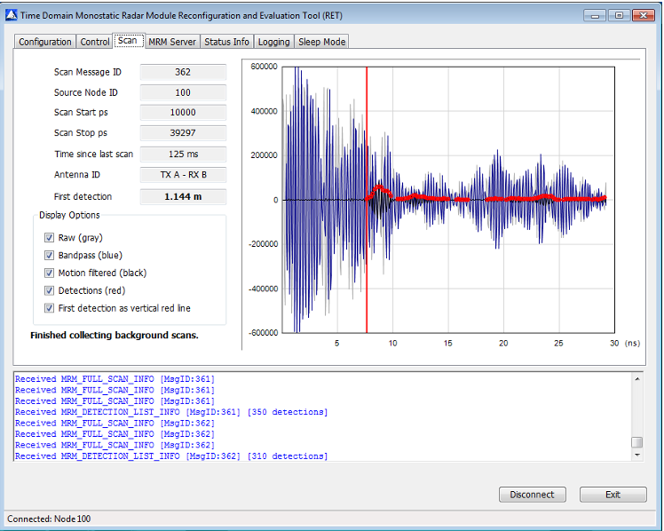

The Scan Tab is used to view scan parameters as well as raw and processed data. An almost live received signal can be observed here.

| Field       | Description  |  
| ----------- | -------------|
| `Scan data plot`| This is a plot of radar scan amplitude or reflectivity (y-axis) as a function of time in nanoseconds (ns) (x-axis). (The API reports the reflectivity as an integer value and time in ps.)  The vertical scale is set when the Scan Tab is selected.  The horizontal scan uses the Scan Start value as the origin and sets that maximum so that it includes the Scan Stop value. |
| `First detection`|  This is an approximate measurement of the distance, in meters, from the Scan Start point to the First Detection. <br> Distance = (Detection_ps – ScanStart_ps)*(Seconds/picoseconds)*C/2 |

### MRM Server tab 
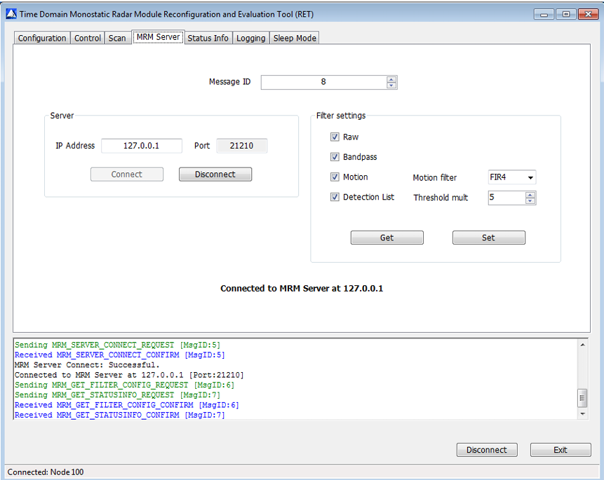

While the MRM Service normally runs on the same PC on which MRM RET is operating, it is 
possible to run the MRM Service from a different PC.  To cause the service to operate on a different 
machine, the user should click the “Disconnect” button, enter the IP address of the target PC, and then 
click the “Connect” button.

| Filter settings | Description  |  
| ----------- | -------------|
|`Raw` | Clicking this box will pass raw scans from the MRM Server to MRM RET, enabling the display of MRM raw radar scan data. |
|`Threshold multiple` | The value selected will set the sensitivity of the detector. The Threshold Multiple is the number of standard deviations that a received signal must deviate from nominal in order to generate a detection. Set to 5.


### Logging Tab
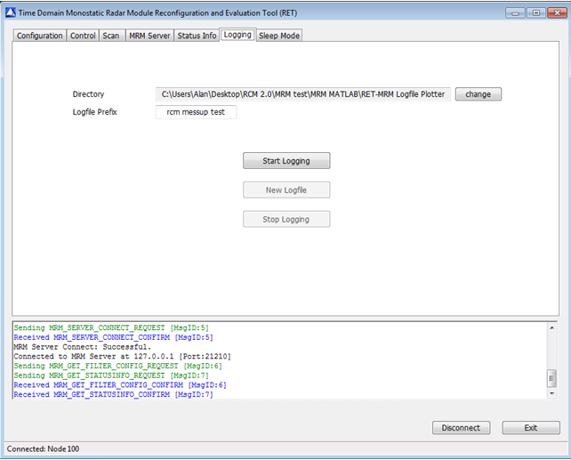

The Logging Tab is provided by MRM RET to support data collection and post-processing analysis. The logfile is a comma-separated variable ASCII .csv text file. 

| Field       | Description  |  
| ----------- | -------------|
| `Directory` | Logfiles will be stored in the directory indicated in the “Directory” field. The user may change the target directory by using the “change” button|
| `Logfile Prefix` | The logfile names are designated by the “Logfile Prefix” field.  The user can change the name by entering the desired prefix name in the ‘Logfile Prefix” field.|
| `Start logging` | When the “Start Logging” button is clicked, MRM RET will add a three digit suffix number to the file name. This name will be displayed on the screen. Each time the log is stopped and started, this suffix number will be incremented. If you don't log the data it cannot be retrived in the future. So log data before every scan if you want to save it. |
| `Stop logging` | When the “Stop Logging” button is clicked, MRM RET will stop logging and the logfile will be closed. <br> **DO NOT FORGET TO CLICK "STOP LOGGING" BUTTON AT THE END OF EACH SCAN SESSION. ELSE THE DATA CANNOT BE PLOTED** |
|`New logfile` | Clicking the “New Logfile” button will close the existing file, open a new logfile with an incremented number, and continue logging. This can be accomplished in the middle of a scanning sequence because clicking this button does not stop and restart the MRM, it merely redirects that data flow to a new file.|

### Initial setup
We used the USB interface which is the simplest just connect directly to the computer. It works fine for the MRM configuration, but can become a bottlneck(data rates are slower and the lag is noticable after a few minutes). If you need to operate in the Rangenet configuration, ethernet is preferablable.

1. Connect the MRM to the node and configure the settings in the configuration tab. Next click on the `get Configuration` button and verify the values. Once satisfied click on `Set Configuration` button, this will save the values to the node. 

2. Select a logging folder and start logging (naming convention is important) in the logging tab. Navigate to scan tab, set the interval and scan counter to the desired values and start scanning. Once it's done, be sure to stop logging in the logging tab (we had to repeat so many experiments just because i forgot to stop the logging and all the data was lost).

3. Plot the data in the .csv file in matlab.

### Data organization 
The radar saves the logged data in .csv file ([example](csv_file.csv)) In the file data entries such as message Id, Timestamp, scan start, scan stop, scan step, filters, number of samples, scan data, etc are logged.

We are interested in Scan data. we organize the data in the form of a matrix. X-axis consists of data entries of an individual scan (quanta * 96 readings). While the Y-axis shows us no. of scans.

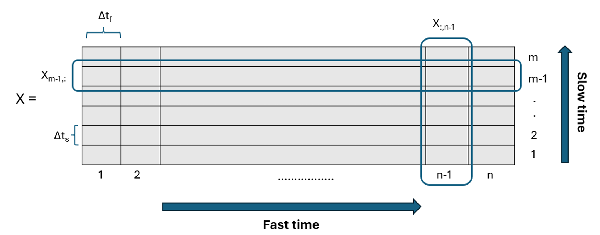

Each element Xm,n represents
the amplitude of the received radar signal at the mth scan and
the nth fast-time index.


--------------------------------


## A. Human Activity Signatures
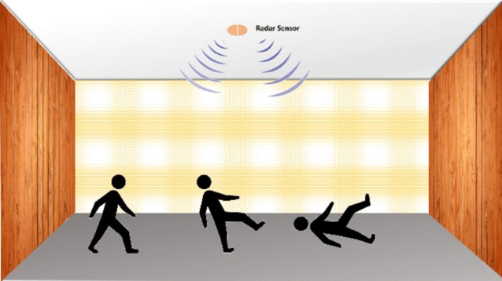

UWB radar provides high-resolution ranging and can penetrate walls, making it highly effective for human activity detection.

Unlike cameras or wearables, it successfully monitors activities while fully preserving user privacy.

### Radar Signature
A radar signature consists of information about characteristic echo signals of a reflecting object (target). Like a fingerprint, it is a way to determine the type of target.

??? example "Example"
    **Weather Radar**<br>
    The WSR-88D(Weather Surveillance Radar, 1988 Doppler) operates by sending out directional pulses at several different elevation angles, which are microseconds long, and when the pulse intersects water droplets or other artifacts, a return signal is sent back to the radar. From this return signal, the diameter of the object, along with distance, and intensity can be calculated, along if the object is moving toward or away from the radar.

    Hook echo 

    

    The hook echo is the classic radar signature for tornadic supercells, appearing as a curved, hook-shaped appendage on reflectivity scans.

    Recognition of the hook echo has been around for decades; even before Doppler radar was invented and instituted in forecast offices, forecasters issued tornado warnings solely based on the visual appearance of a hook echo on radar.

### Experimentation
The experiments were performed in a closed room with some furniture such as beds, tables, chairs and cupboards. The following activities were recorded:

1. Walking away from the radar to a distance of 3m and coming back. 
2. Sitting down at a distance of 2m. 
3. Standing up at a distance of 2m. 
4. Coming towards radar from a distance of 4m and falling suddenly at a distance of about 1.5m from the radar.

### Activity feature extraction
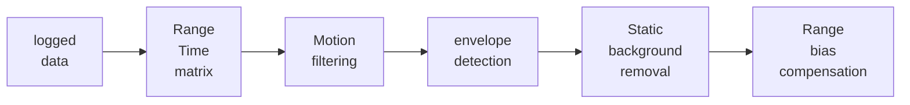
``` mermaid
graph LR
  A[logged <br> data] --> B[Range <br> Time <br> matrix];
  B --> C[Motion <br> filtering];
  C --> D[envelope <br> detection];
  D --> E[Static <br> background <br> removal];
  E --> F[Range <br> bias <br> compensation];
```

The TDSR P452 UWB radar continuously transmits short-duration pulses and records the reflected echoes from the target.

The received radar scans are collected over time and organized into a two-dimensional Range-Time Matrix (RTM), where rows represent successive scans and columns represent range bins. The range vector is calculated using:
$$
R_j = \frac{c \cdot (j \cdot \Delta t_f)}{2}
\tag{1}
$$

### Comparative Evaluation of Motion Filters
A comparative study of four motion filters was conducted to improve the separation of moving targets from stationary background reflections. 

Motion Filters Evaluated:

- FIR2 – Two Tap Difference Filter
$$
Y_{m,n}^{(\mathrm{FIR2})}
= X_{m,n} - X_{m-1,n}
$$
- FIR4 – Four Tap Difference Filter
$$
Y_{m,n}^{(\mathrm{FIR4})}
= 1.0X_{m,n} - 0.6X_{m-1,n} - 0.3X_{m-2,n} - 0.1X_{m-3,n}
$$
- IIR2 – Second-order recursive filter 
$$
Y_{m,n}^{(\mathrm{IIR2})}
=0.8728X_{m,n} - 1.7455X_{m-1,n} + 0.8728X_{m-2,n} + 1.7292Y_{m-1,n}^{(\mathrm{IIR2})} - 0.7618Y_{m-2,n}^{(\mathrm{IIR2})}
$$
- SOD – Second-Order Difference filter
$$
Y_{m,n}^{(\mathrm{SOD})}
= X_{m+1,n} - 2X_{m,n} + X_{m-1,n}
$$

### Envelope detection
The motion-filtered signal is subjected to envelope detection to extract its energy profile. The each element in the envelope matrix is computed as:
$$
E_{m,n}^{(\lambda)} = \left|Y_{m,n}^{(\lambda)}\right|
$$
where each element 𝐸𝑚,𝑛 corresponds to the magnitude of the signal at the 𝑚𝑡ℎ scan and 𝑛𝑡ℎ fast-time index.

### Background subtraction
Subsequently, background subtraction is performed to eliminate static reflections from the environment. The background is estimated as the mean across all slow-time scans:
$$
B^{(\lambda)} = \frac{1}{M}\sum_{m=1}^{M}\widetilde{E}_{m,n}^{(\lambda)}
$$

### Range compensation
To obtain an accurate range representation, a range compensation of approximately 2 m is applied.

### Results
| Raw Scans     |                         |
| :---------: | :----------------------------------: |
|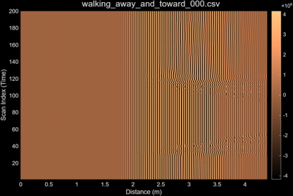     |  |
|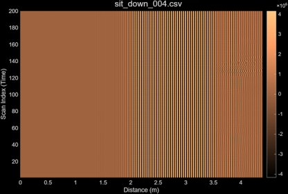    | 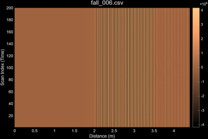 |

| Motion filtered scans   |                     |
| :---------: | :----------------------------------: |
| 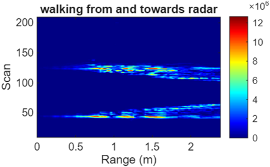     | 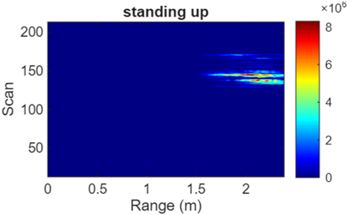 |
| 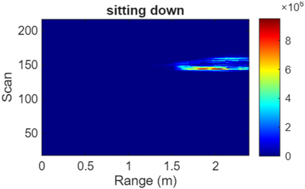    | 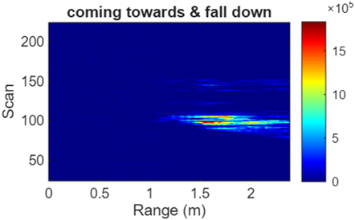 |

| Walking Activity: Comparison of Motion Filter Outputs|
| :---------: | 
| 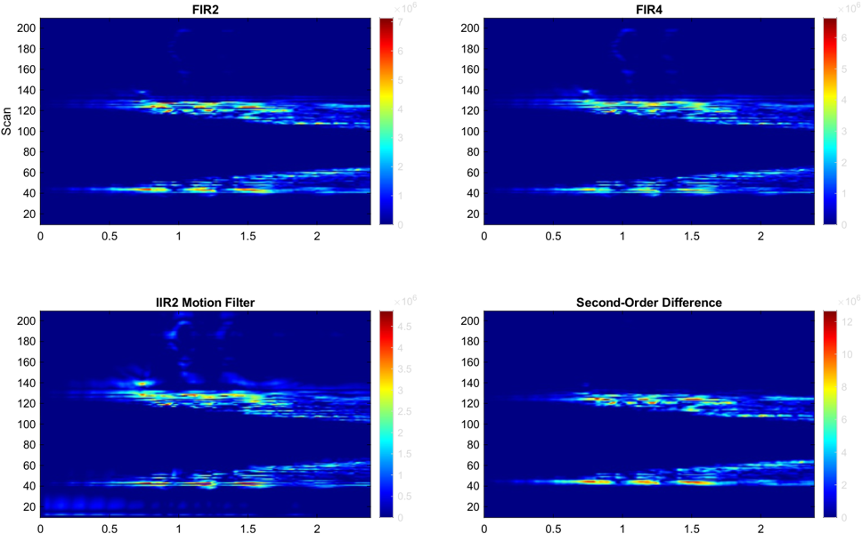
-----------------------

## B. Respiration rate measurement


/// caption
video credit: Anish Raydurg
///

Respiration can be used as a good indicator to monitor vital signs.

Monitoring respiration rates, can also help identify high-risk patients and prevent dangerous situations.

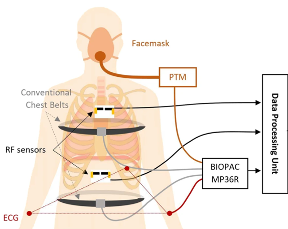

Contact-based methods to measure respiration can be classified into four approaches:

1. manual measurements 
2. measuring changes in impedance using electrodes
3. measuring pressure using belt-type sensors
4.  measuring airflow from the nose and mouth

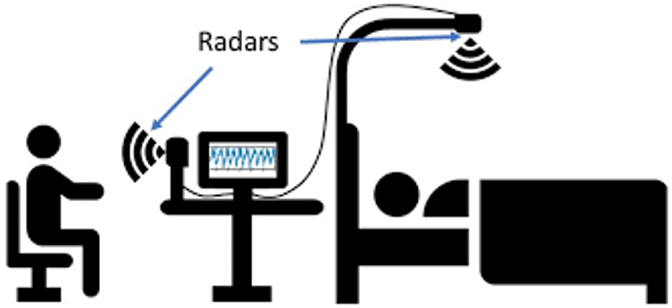

However, prolonged electrode-based monitoring may cause discomfort or be unsuitable for patients with skin complications. 

UWB radar provides a contact-free alternative that can overcome such limitations

###  Signal processing pipeline
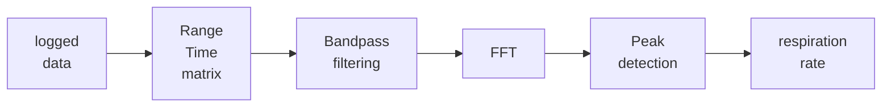
``` mermaid
graph LR
  A[logged <br> data] --> B[Range <br> Time <br> matrix];
  B --> C[Bandpass <br> filtering];
  C --> D[FFT];
  D --> E[Peak <br> detection];
  E --> F[respiration <br> rate];
```

### Experimentation
The experiment was conducted in a controlled indoor environment, where the subject was seated approximately 0.5–1 m in front of the radar, and the readings were recorded as shown in Fig. 1b. Six experimental recordings were acquired from two participants, referred to as Subject A and Subject B, under three controlled breathing conditions each. The objective was to evaluate the radar system under slow, normal, and irregular breathing patterns. The breathing characteristics for each trial are detailed below:

1. Subject A:

Trial 1 (A1): Slow and controlled respiration with slightly longer inhalation and exhalation, generating low-frequency but smooth chest wall movement.

Trial 2 (A2): Regular breathing with intentional reduction in chest displacement, resulting in minimal thoracic motion and weaker radar reflections.

Trial 3 (A3): Natural relaxed breathing with no imposed
control, representing a normal spontaneous respiratory pattern.

2. Subject B:

Trial 1 (B1): Casual breathing at a slightly slower rhythm
than typical resting respiration.

Trial 2 (B2): Irregular breathing pattern in which inhale andexhale durations were not uniform; respiration timing varied, introducing non-stationary chest movement.

Trial 3 (B3): Normal relaxed respiratio

### Bandpass filtering

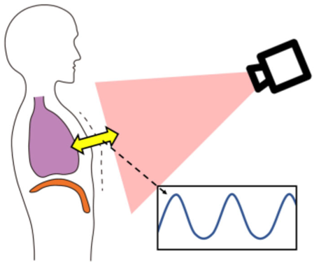

When a UWB pulse reflects from the human chest, the return varies due to periodic expansion and contraction of the thorax.

Let 𝑑0 be the nominal antenna–chest distance and 𝑚(𝑡)the small displacement caused by breathing and heartbeat.
$$
d(t) = d_0 + m_b\sin(2\pi f_b t) + m_h\sin(2\pi f_h t)
$$
A 4th‑order Butterworth band‑pass filter (0.1–0.5 Hz) is used to isolate breathing signals and remove unwanted noise.

This frequency range corresponds to a breathing rate of 6 – 30 breaths per  minute (BPM), covering the typical physiological range for humans.

To estimate the breathing rate, the following procedure is followed:

**Step 1:** Extract slow‑time signals 𝑋_(:,𝑛) from 𝑋∈ Range − Time matrix for 𝑛∈ region of interest scans.

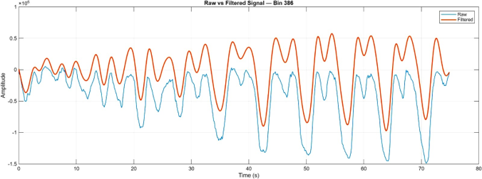

**Step 2:** Pass each slow‑time signal 𝐗_(:,𝑛)through the bandpass filter with zero‑phase forward–backward filtering.

### FFT and Peak detection

**Step 3:** Compute the power spectrum:

$$
P_n(f)
=
\lvert \mathcal{F}\{X_{:,n}\} \rvert^2
$$

**Step 4:** Rank bins based on spectral energy

**Step 5:** Select top – N bins where  N∈{1,2,3,4,5}.

### Rate measurement

**Step 6:** Estimate BPM per bin by identifying the dominant frequency peak 𝑓_𝑝 within the respiration band:
$$ 
\mathrm{BPM}_k = 60f_p 
$$

**Step 7:** Compute average:

$$
\mathrm{BPM}_{\mathrm{avg}}
=
\frac{1}{N}
\sum_{k=1}^{N}
\mathrm{BPM}_k
$$

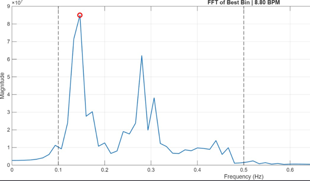

- Respiration usually shows one dominant bin, but nearby bins also carry similar components due to beamwidth spreading.
- Averaging the top‑𝑁 bins reduces noise sensitivity and stabilizes estimation.
- With a slow‑time sampling interval of 125,000𝜇𝑠 (8 Hz), the detectable frequency range is suitable for normal human breathing. 

### Results
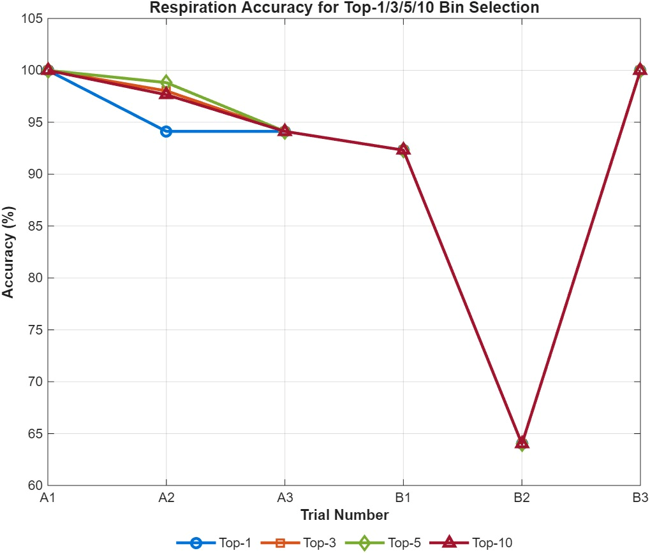

Overall, Multi-bin accumulation (Top-3 and Top-5) improves reliability over single-bin estimation, while Top-10 provides no consistent advantage.

Trial B2 showed irregular breathing, dropping accuracy to ~64% as non‑periodic patterns smeared the spectrum and weakened FFT‑based tracking.

| Respiration rate estimaton using top N bins  |                     |
| :---------: | :----------------------------------: |
|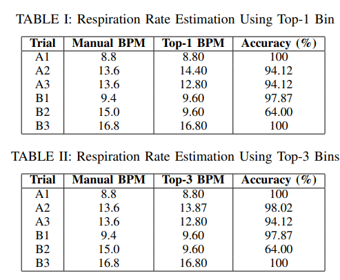| 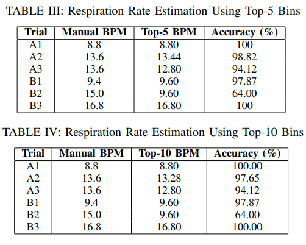|

We infer that high accuracy was maintained during stable breathing (A1, A3, B1, B3). 

Performance declined with irregular or weak movements, showing the need for better handling of non‑stationary respiration.

-----------------------------------------------
## Conclusions
### Human activity recognition

UWB radar, combined with motion filters (FIR, IIR, and especially the Second‑Order Difference filter), reliably captured walking, sitting, standing, and falling signatures. 

The SOD filter provided the clearest activity patterns, though distinguishing similar activities (like sitting vs. standing) remains challenging.

### Respiration monitoring

The system achieved high accuracy under normal breathing, but performance dropped with irregular or weak chest movements, showing limits of amplitude‑based spectral estimation.

-------------------------------------------------

## Codes

=== "readMrmRetLog.m"

    ```matlab
    function [cfg,req,scn,det] = readMrmRetLog(varargin)
    % readMrmRetLog: Function to read MRM-RET log file.
    %
    % Syntax
    % readMrmRetLog
    % readMrmRetLog(fnm)
    % readMrmRetLog(dnm,fnm)
    %
    % Input
    % fnm - string containing file name or complete path name
    % dnm - string containing directory name
    %
    % Output
    % cfg - structure containing configuration data
    % req - structure containing request data
    % scn - structure containing scan data
    % det - structure containing detection data
    %
    % Usage Notes
    % If no file name is provided, readMrmRetLog opens a dialog for the user to
    % select the desired file. The single input fnm can be a file name only or
    % a complete path name. The two inputs dnm and fnm are combined to make a
    % complete path name.
    %
    % See also UIGETFILE, FULLFILE.
    %
    % ChangeLog
    % 20150105 .txt to .csv

    % Copyright © 2011 Time Domain, Huntsville, AL

    % Handle input arguments.
    switch nargin
      case 0
        [fnm,dnm] = uigetfile('*.csv');
      case 1
        dnm = '';
        fnm = varargin{1};
      case 2
        dnm = varargin{1};
        fnm = varargin{2};
      otherwise
        error('Too many input arguments.')
    end

    % Open file.
    fid = fopen(fullfile(dnm,fnm),'rt');

    % Create empty structures.
    N = 100;

    cfg_ = repmat(struct('T',[],'nodeID',[],'Tstrt',[],'Tstp',[],'Nbin',[], ...
        'BII',[],'seg1Nsamp',[],'seg2Nsamp',[],'seg3Nsamp',[],'seg4Nsamp',[], ...
        'seg1Iadd',[],'seg2Iadd',[],'seg3Iadd',[],'seg4Iadd',[],'Iant',[], ...
        'Gtmt',[],'Ichan',[]),1,N);

    req_ = repmat(struct('T',[],'msgID',[],'Nscn',[],'Tint',[],'stat',[]),1,N);

    scn_ = repmat(struct('T',[],'msgID',[],'srcID',[],'Tstmp',[],'Tstrt',[], ...
        'Tstp',[],'Nbin',[],'Nfilt',[],'antID',[],'Imode',[],'Nscn',[],'scn',[]),1,N);

    det_ = repmat(struct('T',[],'msgID',[],'Ndet',[],'det',[]),1,N);

    % Initialize structures and counters.
    Kcfg = 0;
    Kreq = 0;
    Kscn = 0;
    Kdet = 0;

    cfg = [];
    req = [];
    scn = [];
    det = [];

    % Read file to end.
    while ~feof(fid)

      ln = fgetl(fid);

      i = strfind(ln,',');
      fld = textscan(ln(1:i(2)-1),'%s %s','Delimiter',',');

      switch fld{1}{1}

        case 'Timestamp'

        otherwise

          switch fld{2}{1}

            case 'Config'

              Kcfg = Kcfg + 1;

              if Kcfg > length(cfg)
                cfg = [cfg cfg_];
              end

              fld = textscan(ln,'%n %s %n %n %n %n %n %n %n %n %n %n %n %n %n %n %n %n', ...
                  'Delimiter',',');

              cfg(Kcfg) = struct('T',fld{1},'nodeID',fld{3},'Tstrt',fld{4}, ...
                  'Tstp',fld{5},'Nbin',fld{6},'BII',fld{7},'seg1Nsamp',fld{8}, ...
                  'seg2Nsamp',fld{9},'seg3Nsamp',fld{10},'seg4Nsamp',fld{11}, ...
                  'seg1Iadd',fld{12},'seg2Iadd',fld{13},'seg3Iadd',fld{14}, ...
                  'seg4Iadd',fld{15},'Iant',fld{16},'Gtmt',fld{17},'Ichan',fld{18});

            case 'MrmControlRequest'

              Kreq = Kreq + 1;

              if Kreq > length(req)
                req = [req req_];
              end

              fld = textscan(ln,'%n %s %n %n %n','Delimiter',',');

              req(Kreq) = struct('T',fld{1},'msgID',fld{3}, ...
                  'Nscn',fld{4},'Tint',fld{5},'stat',nan);

            case 'MrmControlConfirm'

              fld = textscan(ln,'%n %s %n %n','Delimiter',',');

              if fld{3} == req(Kreq).msgID
                req(Kreq).stat = fld{4};
              else
                error('MrmControlConfirm message ID does not match previous MrmControlRequest message ID.')
              end

            case 'MrmFullScanInfo'

              Kscn = Kscn + 1;

              if Kscn > length(scn)
                scn = [scn scn_];
              end

              i = strfind(ln,',');

              fld = textscan(ln(1:i(16)-1), ...
                  '%n %s %n %n %n %n %n %n %n %n %n %n %n %n %n %n', ...
                  'Delimiter',',');

              scn(Kscn) = struct('T',fld{1},'msgID',fld{3}, ...
                  'srcID',fld{4},'Tstmp',fld{5},'Tstrt',fld{10}, ...
                  'Tstp',fld{11},'Nbin',fld{12},'Nfilt',fld{13}, ...
                  'antID',fld{14},'Imode',fld{15},'Nscn',fld{16},'scn',[]);

              scn(Kscn).scn = str2num(ln(i(16)+1:end));

            case 'MrmDetectionListInfo'

              Kdet = Kdet + 1;

              if Kdet > length(det)
                det = [det det_];
              end

              i = strfind(ln,',');

              if length(i) < 4
                i(4) = length(ln) + 1;
              end

              fld = textscan(ln(1:i(4)-1),'%n %s %n %n','Delimiter',',');

              det(Kdet) = struct('T',fld{1},'msgID',fld{3}, ...
                  'Ndet',fld{4},'det',[]);

              if det(Kdet).Ndet > 0
                det(Kdet).det = reshape(str2num(ln(i(4)+1:end)),2,[]);
              end

          end
      end
    end

    % Close file.
    fclose(fid);

    % Trim structures arrays to elements actually filled.
    cfg = cfg(1:Kcfg);
    req = req(1:Kreq);
    scn = scn(1:Kscn);
    det = det(1:Kdet);
    ```

=== "Motion Filter Comparison"

    ```matlab
    % =========================================================
    % Motion Filter Comparison AFTER RAW SCANS
    % Pipeline:
    % Raw scans -> Motion filter (slow time) -> Envelope -> Plot
    % =========================================================

    close all; clear; clc

    %% ------------------ Load Logfile ------------------
    [fnm,dnm] = uigetfile('*.csv');
    fprintf('Reading logfile %s\n', fullfile(dnm,fnm));
    [cfg,req,scn,det] = readMrmRetLog(fullfile(dnm,fnm));

    %% ------------------ Extract RAW Scans ------------------
    % Use RAW scans (not motion-filtered from server)
    rawIdx = find([scn.Nfilt] == 1);     % Raw scans
    rawScans = reshape([scn(rawIdx).scn],[],length(rawIdx))';
    IDdat = [scn(rawIdx).msgID];

    [Ns, Nr] = size(rawScans);

    %% ------------------ Range Axis ------------------
    Tbin = 32/(512*1.024);      % ns
    c    = 0.29979;             % m/ns
    Rbin = c*(Tbin*(0:Nr-1))/2;

    Rbias = 2;                  % radar bias (meters)
    validR = Rbin >= Rbias;

    rawScans = rawScans(:,validR);
    Rbin_disp = Rbin(validR) - Rbias;

    %% =========================================================
    %% === MOTION FILTERS (SLOW TIME) ==========================
    %% =========================================================

    fprintf('Applying motion filters on RAW scans...\n');

    X = rawScans;

    %% -------- FIR2 (1st difference) --------
    h_fir2 = [1 -1];
    Y_fir2 = filter(h_fir2,1,X,[],1);
    Y_fir2(1,:) = 0;

    %% -------- FIR4 (TDSR MTI) --------
    h_fir4 = [1 -0.6 -0.3 -0.1];
    Y_fir4 = filter(h_fir4,1,X,[],1);
    Y_fir4(1:3,:) = 0;

    %% -------- Second-order difference --------
    h_diff2 = [1 -2 1];
    Y_diff2 = filter(h_diff2,1,X,[],1);
    Y_diff2(1:2,:) = 0;

    %% =========================================================
    %% === ENVELOPE DETECTION (AFTER MOTION FILTER) ============
    %% =========================================================

    fprintf('Envelope detection...\n');

    % Detection LPF (from TDSR)
    b = [0.0103 0.0619 0.1547 0.2063 0.1547 0.0619 0.0103];
    a = [1.0000 -1.1876 1.3052 -0.6743 0.2635 -0.0518 0.0050];

    env = @(x) max(filter(b,a,abs(x),[],2),0);

    E_fir2  = env(Y_fir2);
    E_fir4  = env(Y_fir4);
    E_diff2 = env(Y_diff2);

    %% =========================================================
    %% === SIMPLE AVERAGE CANCELLATION =========================
    %% =========================================================

    fprintf('Applying average cancellation...\n');

    bg_static = mean(E_diff2,1);
    E_diff2_ac = E_diff2 - bg_static;
    E_diff2_ac(E_diff2_ac < 0) = 0;

    bg_static2 = mean(E_fir2,1);
    E_fir2_ac = E_fir2 - bg_static2;
    E_fir2_ac(E_fir2_ac < 0) = 0;

    bg_static3 = mean(E_fir4,1);
    E_fir4_ac = E_fir4 - bg_static3;
    E_fir4_ac(E_fir4_ac < 0) = 0;

    %% =========================================================
    %% === COMPARISON PLOTS ===================================
    %% =========================================================

    figure('Units','normalized','Position',[0.05 0.05 0.9 0.9],'Color','w')

    figure;
    imagesc(Rbin_disp, IDdat, E_fir2_ac)
    axis xy
    title('FIR2')
    ylabel('Scan')
    colorbar

    figure;
    imagesc(Rbin_disp, IDdat, E_fir4_ac)
    axis xy
    title('FIR4')
    colorbar

    figure;
    imagesc(Rbin_disp, IDdat, E_diff2_ac)
    axis xy
    title('Second-Order Difference')
    colorbar

    colormap jet
    ```

=== "Respiration Rate"

    ```matlab
    % plotMrmRetLog.m
    %
    % ======================= PIPELINE OVERVIEW =======================
    % Step 1: Load radar logfile (.csv) using file selection dialog
    % Step 2: Parse logfile into configuration, scan data, and detections
    % Step 3: Separate scans into:
    %         - Raw scans
    %         - Band-pass filtered scans
    %         - Motion filtered scans
    %
    % Step 4: Convert time bins → range bins (distance in meters)
    %
    % Step 5: Compute envelope of motion filtered data
    %         (|signal| + low-pass filtering)
    %
    % Step 6: Generate waterfall plot
    %         (Range vs Scan index vs amplitude)
    %
    % Step 7: Select region of interest (ROI) in range (e.g., 2.8–4 m)
    %
    % Step 8: For each selected range bin:
    %         - Extract slow-time signal
    %         - Remove DC component
    %         - Apply bandpass filter (1–40 BPM)
    %         - Apply zero-phase filtering (filtfilt)
    %         - Apply Hanning window
    %
    % Step 9: Perform FFT per range bin
    %
    % Step 10: Detect dominant peaks → convert to BPM
    %
    % Step 11: Plot FFT spectrum with top BPM estimates
    %
    % ===============================================================

    clear all; close all; clc

    %% Query user for logfile
    % dnm = '.'; fnm = 'day1_exp_1.006.csv';
    [fnm,dnm] = uigetfile('*.csv');
    fprintf('Reading logfile %s\n',fullfile(dnm,fnm));
    [cfg,req,scn,det] = readMrmRetLog(fullfile(dnm,fnm));

    %% Separate raw, bandpassed, and motion filtered data from scn structure
    % (only motion filtered is used)

    %% Pull out the raw scans (if saved)
    rawscansI = find([scn.Nfilt] == 1);
    rawscansV = reshape([scn(rawscansI).scn],[],length(rawscansI))';

    % band-pass filtered scans
    bpfscansI = find([scn.Nfilt] == 2);
    bpfscansV = reshape([scn(bpfscansI).scn],[],length(bpfscansI))';

    % motion filtered scans
    mfscansI = find([scn.Nfilt] == 4);
    mfscansV = reshape([scn(mfscansI).scn],[],length(mfscansI))';

    %% Create the waterfall horizontal and vertical axes
    Tbin = 32/(512*1.024);  % ns
    T0 = 0;                 % ns
    c = 0.29979;            % m/ns

    Rbin = c*(Tbin*(0:size(mfscansV,2)-1) - T0)/2;

    IDdat = [scn(mfscansI).msgID]; % msgID == scanID

    %% The envelope of the motion filtered scans is a low pass of abs value
    fprintf('Computing the envelope of the motion filtered data...\n');

    % Hard code instead
    b = [0.0103 0.0619 0.1547 0.2063 0.1547 0.0619 0.0103];
    a = [1.0000 -1.1876 1.3052 -0.6743 0.2635 -0.0518 0.0050];

    edat = max(filter(b,a,abs(mfscansV),[],2),0);

    %% Plot enveloped motion filtered data as a waterfall
    fprintf('Plotting motion filtered data as a waterfall plot...\n');

    figure('Units','normalized','Position',[0.1 0.2 0.7 0.7],'Color','w')

    imagesc(Rbin,IDdat,edat);
    hold on
    xlabel('R (m)')
    ylabel('Scan Number')
    title('Waterfall plot of motion filtered scans')
    drawnow

    %% ================= FFT PER BIN =================
    fprintf('FFT per range bin with bandpass (1–40 BPM)...\n');

    % --- PARAMETERS ---
    fs_slow = 1 / (125e-3);   % Hz
    num_peaks = 3;

    % BPM → Hz
    f_low = 1/60;             % 1 BPM
    f_high = 40/60;            % 40 BPM

    % --- BANDPASS FILTER DESIGN (Butterworth) ---
    [b_bp, a_bp] = butter(4, ...
        [f_low f_high]/(fs_slow/2), 'bandpass');

    % --- RANGE SELECTION ---
    r_min = 2.8;
    r_max = 4;

    range_idx = find(Rbin >= r_min & Rbin <= r_max);

    % --- FFT SETTINGS ---
    N = size(rawscansV,1);
    Nfft = 8 * 2^nextpow2(N);

    f = (0:Nfft-1)*(fs_slow/Nfft);
    half = 1:floor(Nfft/2);
    f = f(half);

    % --- LOOP CONTROL ---
    plots_per_fig = 10;
    plot_count = 0;

    for i = 1:length(range_idx)

        bin_idx = range_idx(i);

        % --- Extract slow-time signal ---
        slow_signal = rawscansV(:, bin_idx);

        % --- DC REMOVAL ---
        slow_signal = slow_signal - mean(slow_signal);

        % --- BANDPASS + ZERO-PHASE FILTERING ---
        filtered_signal = filtfilt(b_bp, a_bp, slow_signal);

        % --- HANNING WINDOW ---
        win = hann(length(filtered_signal));
        windowed_signal = filtered_signal .* win;

        % --- FFT ---
        fft_data = fft(windowed_signal, Nfft);
        fft_mag = abs(fft_data(half));

        % --- FIND TOP PEAKS ---
        [pks, locs] = findpeaks(fft_mag, 'SortStr','descend');

        num_valid = min(num_peaks, length(locs));

        top_freqs = f(locs(1:num_valid));
        top_bpms = top_freqs * 60;

        % --- FORMAT TITLE STRING ---
        bpm_str = sprintf('%.1f ', top_bpms);

        % --- NEW FIGURE EVERY 10 ---
        if mod(plot_count, plots_per_fig) == 0
            figure('Color','w');
            plot_count = 0;
        end

        plot_count = plot_count + 1;

        subplot(5,2,plot_count);
        plot(f, fft_mag, 'LineWidth', 1.5);
        grid on;

        title(sprintf('R = %.2f m | Top BPM: [%s]', ...
            Rbin(bin_idx), bpm_str));

        xlabel('Frequency (Hz)');
        ylabel('|FFT|');

    end
    ```


-------------------------
## Credits
1. To Prof. Robert M. O'Donnell, MIT Lincoln Laboratory for the lecture series: Introduction to Radar Systems.
2. To Brian Douglas, Matlab techtalks for the video on Pulse-Doppler Radar.
3. SOURCE: Monostatic Radar Module Reconfiguration and Evaluation Tool (MRM RET) User Guide 