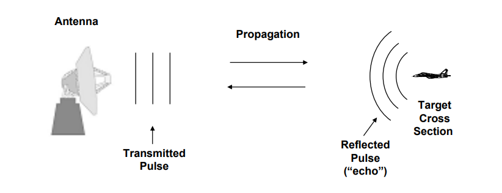
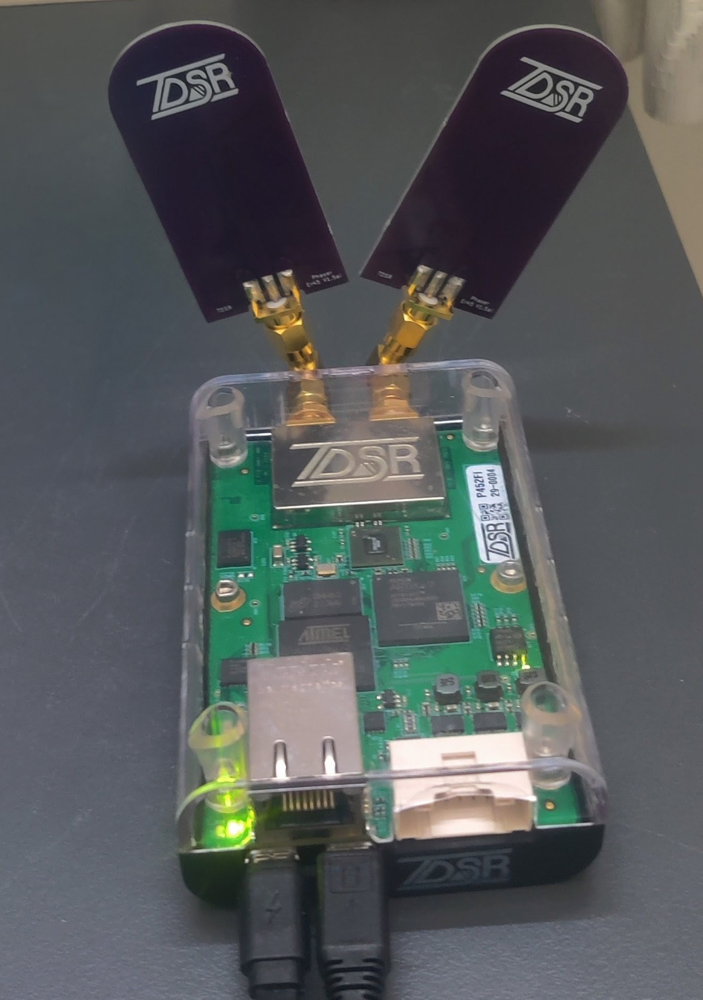
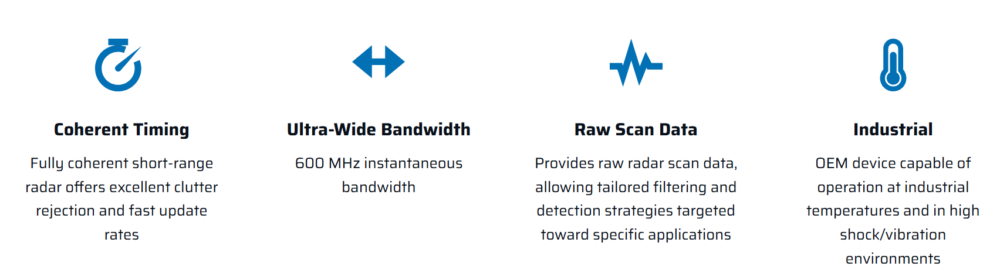
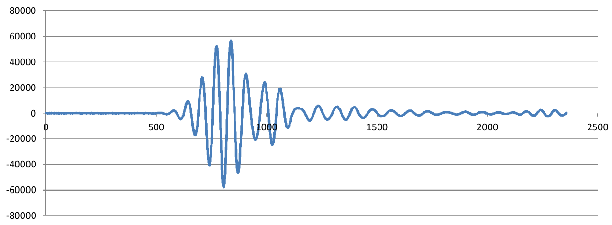
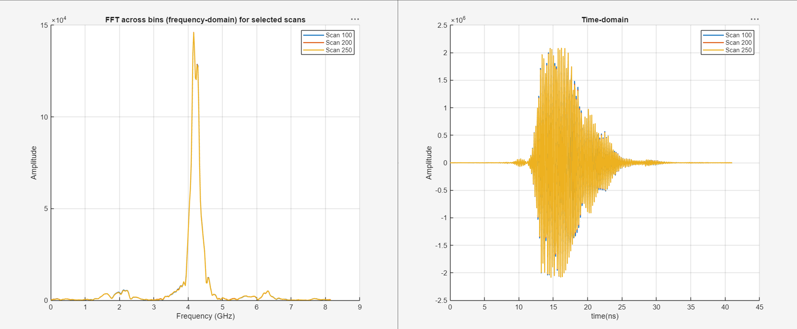
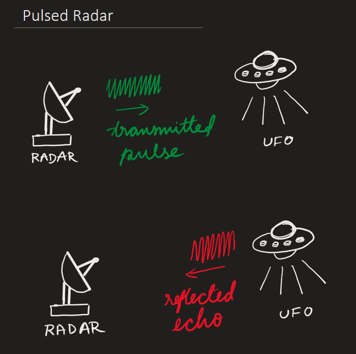
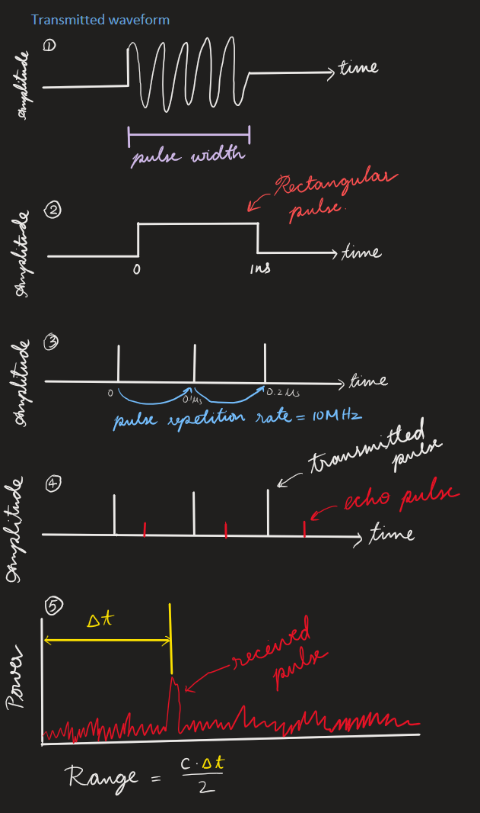
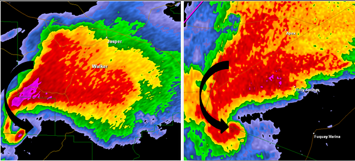

# Human Activity and Vital Sign Recognition using Ultra Wide Band Radar
{width="500"}

UWB Radar, a solution to both contact-free respiration monitoring and non-invasive human motion detection.

<!-- more --> 

Respiratory rate is an essential clinical parameter, often assessed using ECG-based systems; however, prolonged electrode-based monitoring may cause discomfort or be unsuitable for patients with skin complications. UWB radar provides a contact-free alternative that can overcome such limitations. 

Additionally, UWB radar plays a crucial role in human activity detection due to its high-resolution ranging and ability to penetrate walls, while preserving privacy compared to cameras or wearables. It excels in low-visibility environments, ensuring reliable activity monitoring even in darkness.
 

??? tip ":trophy: WAMS 2026 Award for Best Student Paper Award in All Tracks"
     To verify go to [WAMS 2026 student awards](https://wams2026.com/student-awards/) and scroll down to S3.
    

    **What does this award mean to me?**

    This is our first research paper, so we did not expect much. All our focus was on delivering our best - whether it is organisation, replicability or transparency. Later I realized that with persistence and collaboration we can achieve great things in life.

    Additionally, we are grateful to our mentor [Dr. Puli Kishore Kumar](https://nitandhra.ac.in/dept/ece/20015) for guiding us and has provided the opprtunity to work with state of the art radar sensor. Finally I would like to acknowledge [Anish](https://github.com/anish609609) for his unwavering support and hardwork. His dedication to this work is monumental. 

???+ abstract
    This work presents a lightweight framework for UWB-based human activity classification and respiration rate estimation utilizing TDSR P452 ultra-wideband (UWB) radar sensor. The proposed approach classifies four distinct activities: sitting, standing, falling, and walking. Human activity signatures are extracted from the received radar signals using motion filtering and background subtraction to facilitate activity classification. Four filtering techniques—namely FIR2, FIR4, IIR2, and a second-order difference filter—undergo evaluation for motion detection, with the second-order difference filter demonstrating the most effective performance. Radar-based vital sign monitoring offers a contact-free and non-invasive approach for medical and surveillance applications. Band-pass filtering and peak detection are employed to estimate the respiration rate of the subject from the received radar signals. Comparison with manual participant breathing counts validates the accuracy of the estimated respiration rates. 

## Tools
[TDSR P452 Radar](https://tdsr-uwb.com/radar-sensor/) 
[MRM GUI](https://tdsr-uwb.com/radar-software/) 
[Matlab R2025b](https://in.mathworks.com/products/new_products/release2025a-2025b.html) 

Let's start with the basics

## Radar basics

### What is a Radar?
The word radar comes from the acronym **RA**dio **D**etection **A**nd **R**anging. As the name implies, radars use radio waves to determine the distance and velocity of the targets they hit. A radar system usually consists of a transmitter to send out radio signals and a receiver to catch any reflected energy from targets.

### Early use of radars
Radars were first used to lift the fog of war. In 1940, Great Britain utilized a network of radar installations known as the **Chain Home system** to provide crucial early warning during the Battle of Britain. By detecting incoming German bombers from as far away as 160 miles, these systems allowed the British to strategically concentrate their Spitfire and Hurricane interceptors against attacking forces.

This timely intelligence helped the British achieve numerical parity and successfully deny Germany the air superiority required for a planned invasion. Consequently, the invasion of Great Britain was postponed indefinitely, securing a vital staging area for the Allies.

### Applications
+ Surveilance
+ Tracking
+ Fire control
+ Target ID/discrimination
+ Ground surveillance/reconnaissance
+ Ground mapping
+ Moving target detection
+ Air traffic control
+ Missile seekers

### Attributes
+ Long range
+ All weather
+ Day/night
+ 3-space target location
+ Reasonably robust against countermeasures

### TDSR P452 radar sensor  
{width="100", align="left"}

The P452 UWB Module is an Ultra Wideband radio transceiver designed for precise ranging, communication, and radar applications, featuring high accuracy and low power consumption. It operates using Two-Way Time-of-Flight technology, supports multiple communication protocols, and can function in various radar configurations. 

The radar sensor consists of two omnidirectional antennas. We operated the radar in monostatic mode, so one antenna is the transmitter and the other is the receiver. Additionally, it has 2 usb B ports (one for data and the other is for power.), 1 ethernet, and GPIO ports (for API control). 

### Technical Specifications

| Specification | Description                          |
| ----------- | ------------------------------------ |
| **Transmitted pulse**      |      Derivative of the Gaussian pulse, specifically a 500ps monocycle waveform as shown below. The waveform starts as a Gaussian pulse but is then filtered to meet the regulatory emissions mask.  |
| **Pulse duration**     |   1ns |
| **Pulse repetition frequency**   |     10MHz|
| **Pulse spectral density** |  -41 dBm/MHz (max) |
|**Antenna** | planar elliptical dipole Ultra-wideband (UWB) antenna |
| **Polarisation** |  linear polarisation |
| **centre frequency** | 4.3GHz |
| **Bandwidth** | 600MHz, functioning within a range of 4.0 to  4.6GHz |
| **operating modes** |monostatic (transmitter and receiver are co-located or same antenna), bistatic, or multistatic|
|Transmitted pulse | |
| Received pulse in frequency and time domain |  |

### Working principle

Pulse radar systems send out short bursts or pulses of high energy waves followed by long periods of silence, where the receiver is listening for the reflected signal.

1. So the transmitted waveform in pulse radar would look something like in fig 1. Initially, the transmitter is idle and then it transmits the signal for some period (known as pulse width) and then stops. (Note: the illustration assumes the carrier wave contains only 1 frequency component. For P452, the frequency spectrum is spread over from 4.0 to 4.6GHz)

2. Assume the transmitted pulse has frequency of 4.3GHz. Since the transmit frequency is so high, it can be represented as an outline of the amplitude of the signal, as shown in fig 2. This fixed frequency scheme is called a rectangular pulse.

3. In a pulsed radar system, the pulse has to radiate out, reflect off of an object and return to the radar before the next pulse is sent out. This is so that there is no ambiguity as to which pulse the echo belongs to. It's always the pulse that is just sent. But because of this if we want a radar that can operate over long distances, then we need to allow enough time between pulses to account for the speed of light travel to and from the object. In fig. 3 we are sending out a pulse every 0.1μs or with a pulse repetion frequency of 10MHz.

4. Within the maximum umambiguious range, each pulse will have an associated echo pulse. These signals are much weaker than the transmit pulse, as much of the power is lost to the environment, shown in fig. 4.

5. The received signal will look something like in fig.5, as electronics and environment introduce noise into the signal. The range to the object is calculated by determining the round trip distance that light would have travelled in Δt time.

## MRM GUI

### Initial setup

### Data collection

### Controls
| Field       | Description  | Range| Example |
| ----------- | ------------------------------------ |
| `GET`       | :material-check:     Fetch resource  |
| `PUT`       | :material-check-all: Update resource |
| `DELETE`    | :material-close:     Delete resource |

## A. Human Activity Signatures

### Radar Signature
A radar signature consists of information about characteristic echo signals of a reflecting object (target). Like a fingerprint, it is a way to determine the type of target.

??? example "Example"
    **Weather Radar** 
    The WSR-88D(Weather Surveillance Radar, 1988 Doppler) operates by sending out directional pulses at several different elevation angles, which are microseconds long, and when the pulse intersects water droplets or other artifacts, a return signal is sent back to the radar. From this return signal, the diameter of the object, along with distance, and intensity can be calculated, along if the object is moving toward or away from the radar.

    Hook echo 

    

    The hook echo is the classic radar signature for tornadic supercells, appearing as a curved, hook-shaped appendage on reflectivity scans.

    Recognition of the hook echo has been around for decades; even before Doppler radar was invented and instituted in forecast offices, forecasters issued tornado warnings solely based on the visual appearance of a hook echo on radar.

## B. Respiration rate measurement

## Credits
1. To Prof. Robert M. O'Donnell, MIT Lincoln Laboratory for the lecture series: Introduction to Radar Systems.
2. To Brian Douglas, Matlab techtalks for the video on Pulse-Doppler Radar.